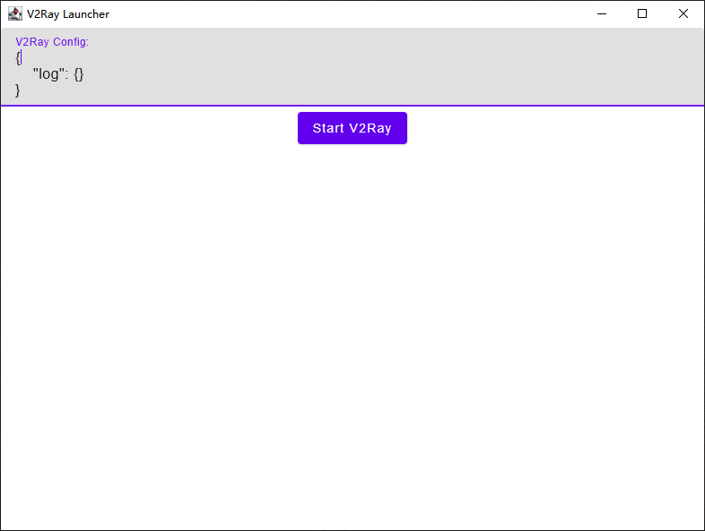

# V2RayLauncher

V2RayLauncher is a deadly simple V2Ray GUI Client based on [Compose Multiplatform](https://github.com/JetBrains/compose-jb).
You can easily distribute your V2Ray configuration file by adding config.json into the ZIP file. And the users can run V2RayLauncher.exe to start and stop a V2Ray instance.

[Download](https://github.com/PineAG/V2RayLauncher/releases/tag/latest)

